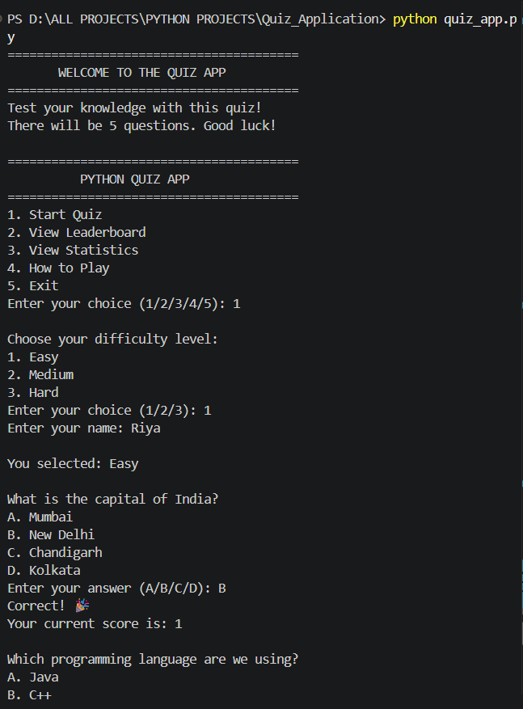
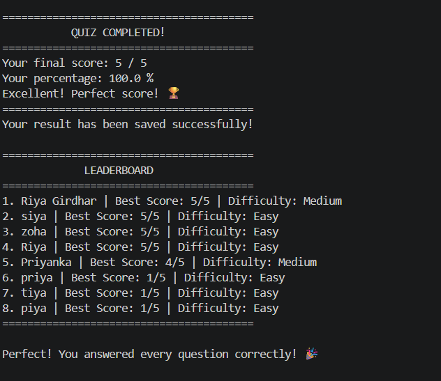
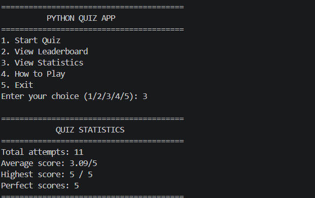

# Python Quiz Application

A command-line quiz application built using Python.

## Features
- Three difficulty levels: Easy, Medium, and Hard
- Multiple-choice questions
- Input validation
- Score and percentage calculation
- Feedback based on performance
- Review of incorrect answers
- JSON-based leaderboard
- Quiz statistics
- How to Play instructions
- Main menu for navigation

## 📸 Screenshot

## Technologies Used
- Python
- JSON
- File handling
- Functions, loops, lists, and dictionaries

## How to Run
1. Install Python.
2. Open the project folder in VS Code.
3. Run `quiz_app.py` in the terminal.

## Data Storage
Quiz results are saved locally in `leaderboard.json`.